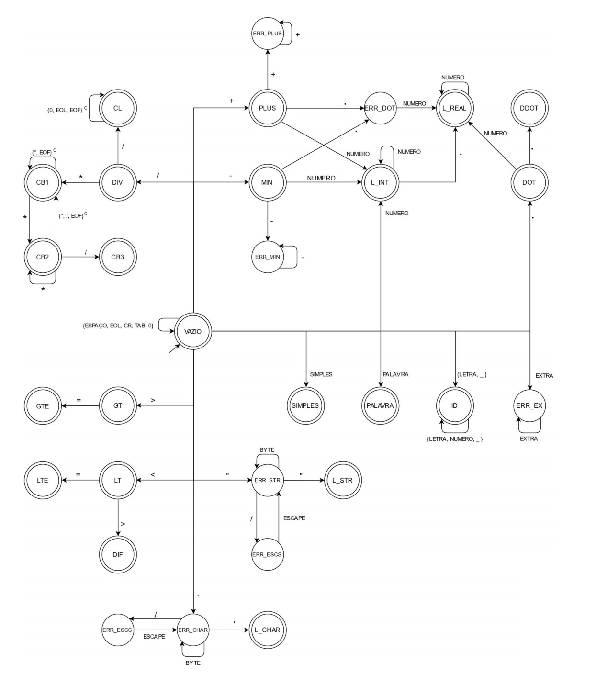

# GRDLexer


<p align="center"><em>Finite State Machine used by the lexer</em></p>

This is the lexer part of the GRDCompiler. The first step in compiling a program file is converting all letters and symbols into program tokens, these can be: Operation tokens (+, -, <, >, &&, ||,  ...); literals (integers, reals, strings, characters, ...); Comments; Reserved words; Identifiers; and any other token that the language may have.

The above figure shows how this lexer makes decisions based on a input character to reach a resulting token. This tokens are later sent to the [parser](../GRDParser) for the syntax analysis.

For all the details about the Finite State Machine and how the lexer processes the input characters you can check the [manual](docs/manual-automato.pdf) (Portuguese only).

## Running the lexer
If you are in Windows and have Visual Studio installed, you can compile this program from the command prompt for Visual Studio by simply running:
```
nmake
```
However you can also use any other way that you would like.

With the program compiled you can call the lexer from the command line by:
```
GRDlexer <filename>
```

In the folder examples you will find some sample code that can be used to test the program. If you run the lexer on the first example you will have the following output:
```
> GRDlexer examples\example1.grd


=================PROGRAMA EM TOKENS====================


Linha| Tokens
 1   |
 2   |
 3   | PROGRAM ID SEMICOLON
 4   |
 5   |
 6   | PROCEDURE ID LPARENTHESIS ID COMMA ID COLON INTEGER SEMICOLON ID COLON CHAR RPARENTHESIS
 7   |
 8   |
 9   | SEMICOLON
 10  |
 11  |
 12  | PROCEDURE ID
 13  |
 14  |
 15  | SEMICOLON
 16  |
 17  | CONST
 18  | ID EQUAL INTEGER SEMICOLON
 19  | ID EQUAL REAL SEMICOLON
 20  | ID EQUAL STRING SEMICOLON
 21  |
 22  | DECLARAVARIAVEIS
 23  | ID COMMA ID COMMA ID COLON REAL SEMICOLON
 24  | ID COMMA ID COLON STRING SEMICOLON
 25  |
 26  |
 27  | BEGIN
 28  | SEMICOLON
 29  | END
 30  |
 31  | BEGIN
 32  | ID EQUAL L_INT STAR L_REAL SEMICOLON
 33  | ID EQUAL ID L_INT SEMICOLON
 34  | ID EQUAL ID DIV L_INT SEMICOLON
 35  | ID EQUAL L_REAL PLUS L_REAL SEMICOLON
 36  |
 37  |
 38  |
 39  |
 40  |
 41  |
 42  |
 43  | ID EQUAL L_INT L_INT SEMICOLON
 44  | CHAMAPROCEDURE ID SEMICOLON
 45  |
 46  | END
 47  |
 48  | DOT


=================DETALHES DOS TOKENS====================


 Codigo Token |    Nome Token     | Linha | Lexema
      9       | PROGRAM           | 3     | program
      16      | ID                | 3     | exemplo
      42      | SEMICOLON         | 3     | ;
      10      | PROCEDURE         | 6     | procedure
      16      | ID                | 6     | proc1
      50      | LPARENTHESIS      | 6     | (
      16      | ID                | 6     | int1
      47      | COMMA             | 6     | ,
      16      | ID                | 6     | int2
      43      | COLON             | 6     | :
      14      | INTEGER           | 6     | integer
      42      | SEMICOLON         | 6     | ;
      16      | ID                | 6     | ch1
      43      | COLON             | 6     | :
      24      | CHAR              | 6     | char
      49      | RPARENTHESIS      | 6     | )
      42      | SEMICOLON         | 9     | ;
      10      | PROCEDURE         | 12    | procedure
      16      | ID                | 12    | proc2
      42      | SEMICOLON         | 15    | ;
      23      | CONST             | 17    | const
      16      | ID                | 18    | const1
      31      | EQUAL             | 18    | =
      14      | INTEGER           | 18    | integer
      42      | SEMICOLON         | 18    | ;
      16      | ID                | 19    | const2
      31      | EQUAL             | 19    | =
      7       | REAL              | 19    | real
      42      | SEMICOLON         | 19    | ;
      16      | ID                | 20    | const3
      31      | EQUAL             | 20    | =
      5       | STRING            | 20    | string
      42      | SEMICOLON         | 20    | ;
      22      | DECLARAVARIAVEIS  | 22    | declaravariaveis
      16      | ID                | 23    | real1
      47      | COMMA             | 23    | ,
      16      | ID                | 23    | real2
      47      | COMMA             | 23    | ,
      16      | ID                | 23    | real3
      43      | COLON             | 23    | :
      7       | REAL              | 23    | real
      42      | SEMICOLON         | 23    | ;
      16      | ID                | 24    | st1
      47      | COMMA             | 24    | ,
      16      | ID                | 24    | st2
      43      | COLON             | 24    | :
      5       | STRING            | 24    | string
      42      | SEMICOLON         | 24    | ;
      26      | BEGIN             | 27    | begin
      42      | SEMICOLON         | 28    | ;
      19      | END               | 29    | end
      26      | BEGIN             | 31    | begin
      16      | ID                | 32    | x
      31      | EQUAL             | 32    | =
      37      | L_INT             | 32    | 5
      48      | STAR              | 32    | *
      36      | L_REAL            | 32    | 2.0
      42      | SEMICOLON         | 32    | ;
      16      | ID                | 33    | x
      31      | EQUAL             | 33    | =
      16      | ID                | 33    | x
      37      | L_INT             | 33    | +1
      42      | SEMICOLON         | 33    | ;
      16      | ID                | 34    | y
      31      | EQUAL             | 34    | =
      16      | ID                | 34    | x
      44      | DIV               | 34    | /
      37      | L_INT             | 34    | -2
      42      | SEMICOLON         | 34    | ;
      16      | ID                | 35    | y
      31      | EQUAL             | 35    | =
      36      | L_REAL            | 35    | .7
      35      | PLUS              | 35    | +
      36      | L_REAL            | 35    | -8.
      42      | SEMICOLON         | 35    | ;
      16      | ID                | 43    | x
      31      | EQUAL             | 43    | =
      37      | L_INT             | 43    | 4
      37      | L_INT             | 43    | +2
      42      | SEMICOLON         | 43    | ;
      25      | CHAMAPROCEDURE    | 44    | chamaprocedure
      16      | ID                | 44    | proc2
      42      | SEMICOLON         | 44    | ;
      19      | END               | 46    | end
      46      | DOT               | 48    | .
```

As you can see the program is very detailed about all the tokens it found, it's a great way to understand how a compiler breaks the input text into components.